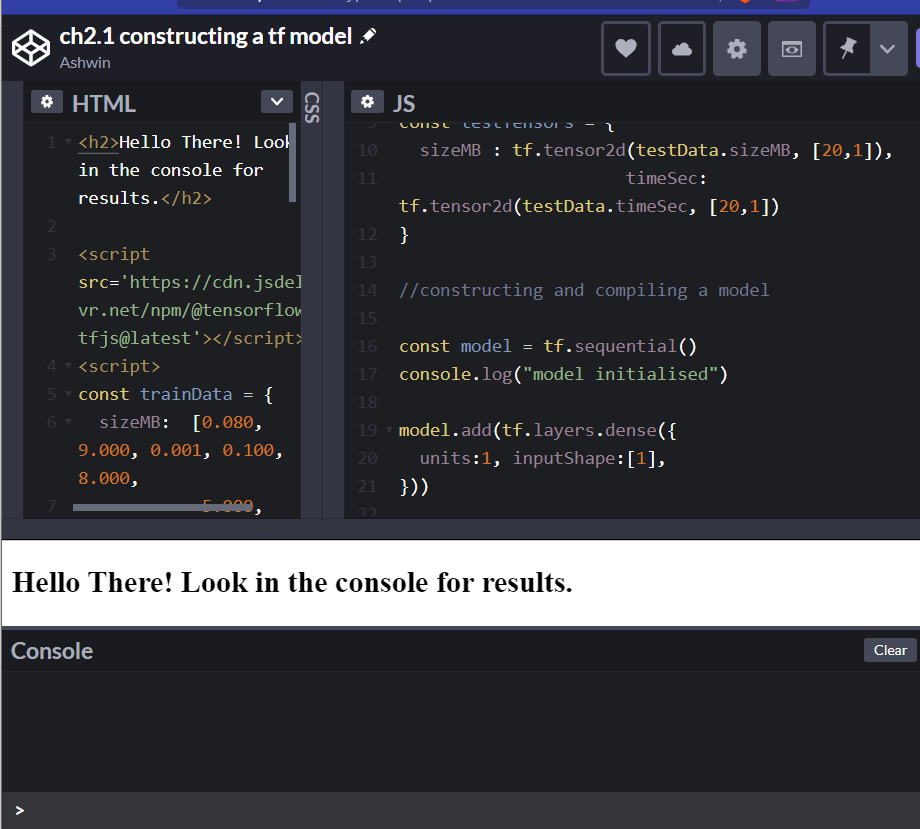
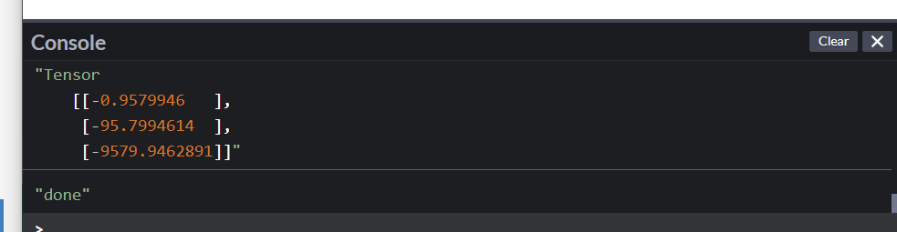
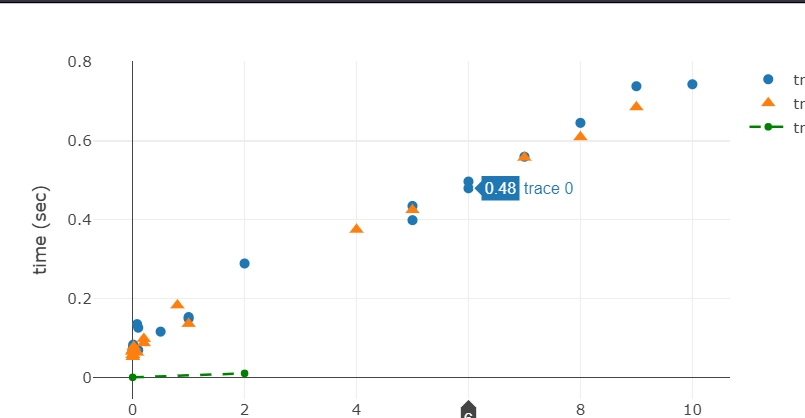
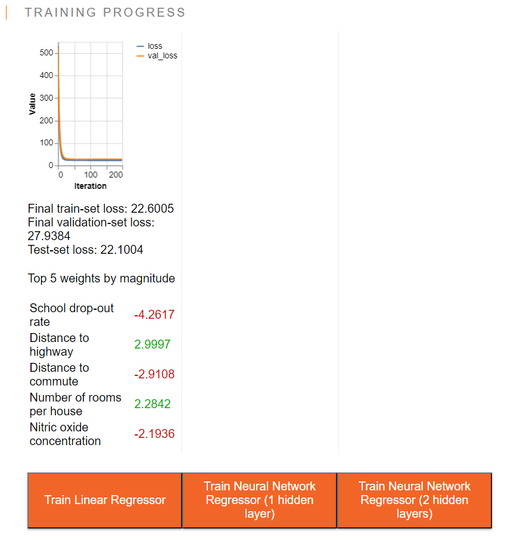
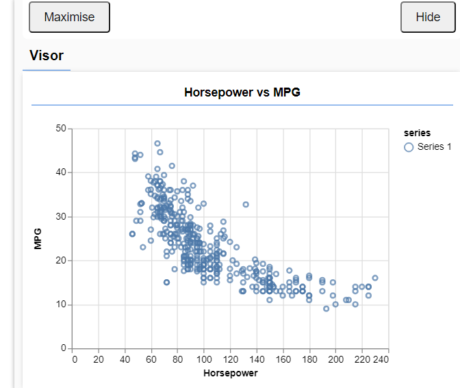
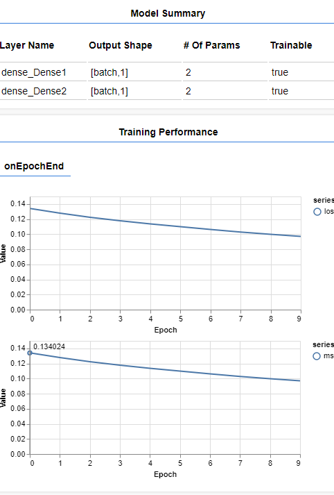
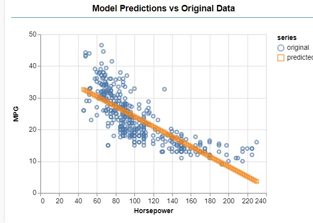

# Gentle introduction

Chapter 2 : All listings : https://codepen.io/collection/Xzwavm/

## predicting duration of a download using tensorflow.js

Can you predict how much time will it take your file to download?

Starter code : codepen.io/tfjs-book/pen/VEVMbx

My pen : https://codepen.io/fanbyprinciple/pen/LYbwJLE

Page 64 .

What we are attempting is linear regression

`timeSec = kernel * sizeMB + bias`

### What we need after defining a model

1. A measure to tell us how well we are doing at a fiven setting of weights

loss function -  to calculate the network performance no the training data and steers itself inthe right direction

2. A method to update the weights values so that next time we will do better thatn what we are currently doing

Optimizer - algorithm thorugh which model updates a parameter

### Why use weird Async syntax?

The fit() method can often be long-running, lasting for seconds or minutes. Therefore, we utilize the async/await feature of ES2017/ES8 so that this function can be
used in a way that does not block the main UI thread when running in the browser.
This is similar to other potentially long-running functions in JavaScript, such as async
fetch. Here, we wait for the fit() call to finish before going on, using the Immediately Invoked Async Function Expression pattern, but future examples will train in
the background while doing other work in the foreground thread.

But it is not working in my case:

We need a diversion and learn about async in javascript.

## Regression using tensorflow.js

Meanwhile testing other waters, Daniel shiffman has outstanding material on youtube in Javascript, this code shows how tensorflow.js can be used for regression.

regression lines: https://editor.p5js.org/fanbyprinciple/sketches/N32mb1VZP

## Async in Javascript

Page 70

## Continuing

## The training loop

1. Draw a batch of training samples x and corresponding y_true
2. Run the network get prediction
3. Compute the loss
4. update the weights

# Working on Boston housing Project

Page 88
need to run the tfjs example - Running unsuccessfully
default app running - 
install yarn - DONE
rewriting boston data on your own. - NOT DONE

# Parts of Boston housing dataset explained

1. getting the data from url and putting it in the right format using tesnor 2d

2. Absolute mean error is not so good whenit comes to punishing the errors we can use Mean squared error

3. Tesnorflow.js optimises its computation by scheduling the GPU, tensors may not always be accessible to the CPU. the calls to dataSync is for finishinghte operations and then asking cpu to take over

4. Data normalisation :scaling features so that they have zero mean and unit standard deviation.

5. data.mean(0) means we need to take mean value over 0th index tensor.

6. boradcasting is done in tfjs if the matrix sizze is compatible

7. Linear regression model is simple : we are calling tf.Sequqntial then adding a dense layer with one unit indicating 1 output

8. We need to specify loss and optimizer before we call model compile. optimizer would be tf.train.sgd, and loss would be meanSquaredError

9. Model.fit() essentially does the same thing, it matches trainFeatures with trainTarget over the batchSize for the num of epochs

10. validation datat can be introduced through using validation split

## Interpreting the model

`output = kernel * features + bias`

our repsonsibility is to train kernel and bias

we can use `model.laesr[0].getWeights()[0]` to extract model weight.

# Exercises

1. Changing the inputs in the data file size example

2. MOdify normalisation in section 2.3.5. and verify that it no longer trains

3. CAn we remove some features in boston housing dataset.

4. gradient descent how does it make model converge in a better manner than standard

5. Can we print the features associated with small weights.

Page 105 

# Project

1. Try boston housing dataset

2. try using tfjs on a different dataset

3. attempt exercise

## Possible links

1. Google codelabs : https://codelabs.developers.google.com/codelabs/tfjs-training-regression#0

2. Digit recognizer from kaggle : https://medium.com/@wl1508/use-tensorflow-js-to-do-kaggle-a-practice-of-deep-learning-training-dd672d73e723

## Google codelabs

We are working with cars and horsepower dataset for a linear regression model.

We will make a webpage that uses tensorflow.js to train a dataset in browser given horsepower the model will be able to predict the mileage , i.e. miles per gallon.

https://codepen.io/fanbyprinciple/pen/abpmQja?editors=0010

Tut page: https://codelabs.developers.google.com/codelabs/tfjs-training-regression#2

Training :

Problem with prediction!

## Polynomial regression

From the coding train:

live at : https://editor.p5js.org/fanbyprinciple/sketches/cf9AZcOhP

