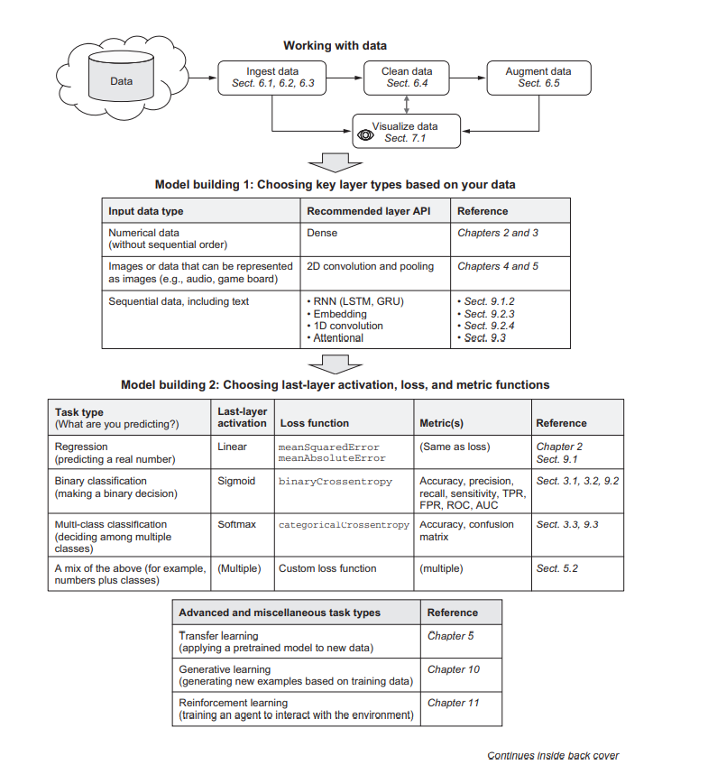

# Repository of Deep Learning with Javascript
<I>Running Neural network with tensorflow.js</I>

I am trying to make a code repository for this book, because frankly it is difficult to find it on github. If you find one do share.

Contributions welcome.

This is the workflow in the front page, does a good job of covering what this book does :



Script source to latest tensorflow.js 
```html
<script src='https://cdn.jsdelivr.net/npm/@tensorflow/tfjs@latest'>
```